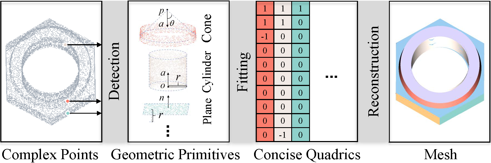
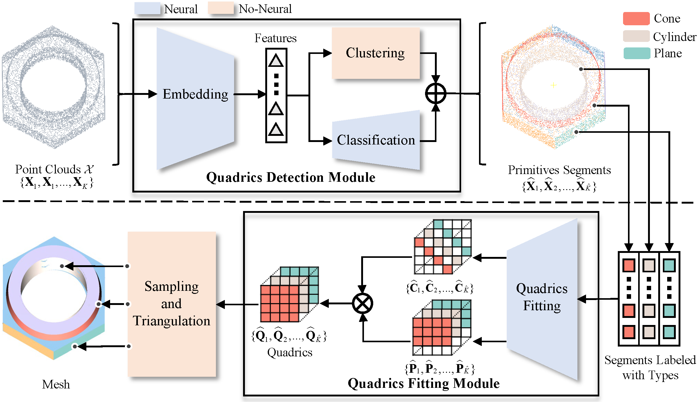

# [QuadricsNet: Learning Concise Representation for Geometric Primitives in Point Clouds](https://github.com/MichaelWu99-lab/QuadricsNet)

*Authors:* Ji Wu, [Huai Yu](https://scholar.google.com/citations?user=lG7h27kAAAAJ&hl=zh-CN), [Wen Yang](http://www.captain-whu.com/yangwen_En.html), [Gui-Song Xia](http://www.captain-whu.com/xia_En.html)

This repository contains the official PyTorch implementation of the [QuadricsNet](https://arxiv.org/pdf/2309.14211.pdf) paper.

[Paper](https://arxiv.org/pdf/2309.14211.pdf) | [Video](https://www.youtube.com/watch?v=0EFhMufuUSI) | Data ([Google Drive](https://drive.google.com/file/d/1toRuKRauOkjEfmZeH2EovYTNeNY_nRJ0/view?usp=drive_link), [Baidu Drive](https://pan.baidu.com/s/1OMnOz8jiSUOyGEC9iTSaSg?pwd=lyou))

# Introduction
QuadricsNet is an end-to-end framework to learn a concise representation with only 10 parameters for diverse geometric primitives in 3D point clouds. Experiments of primitive parsing on the collected dataset and structure mapping on real-world scenes demonstrate that the quadrics representation is effective and the QuadricsNet framework is robust.



# Network Architecture


# Qualitative results


# Installation
* Basic environment:
```shell
conda env create -f environment.yml -n QuadricsNet
conda activate QuadricsNet
```
* To generate visual results, lightweight MATLAB environment needs to be built. Download MATLAB runtime: [Google Drive](https://drive.google.com/file/d/12YtgYTj9RG-zvK6V29071lFh1X2kd5-G/view?usp=drive_link) or [Baidu Drive](https://pan.baidu.com/s/13Wl3uz_xTNcJsKV9suA-OA?pwd=fy8k), and then install it:
```shell
# Install MATLAB runtime
cd <matlab_runtime_Path>
unzip {matlab_runtime}.zip
./install -mode silent -agreeToLicense yes

# Load {matlab_runtime_install_Path} into an environment variable
export LD_LIBRARY_PATH={matlab_runtime_install_Path} # {matlab_runtime_install_Path} will be printed in the terminal after installation of MATLAB runtime.

# Install quadrics2points function
cd <QuadricsNet_Path>/src/quadrics2points/for_redistribution_files_only/
python setup.py install
```

# Quickstart with the pretrained model
* It is recommended to use at least 128 GB of RAM for more accurate reconstruction.
* Qualitative results are in `logs\results_vis`.
```shell
python test_e2e_vis.py configs/configs_test/config_demo.yml 40000 # 40000 is the number of downsampling points during reconstruction, which can be adjusted based on memory size.
```

# Dataset
The Quadrics dataset is available: [Google Drive](https://drive.google.com/file/d/1toRuKRauOkjEfmZeH2EovYTNeNY_nRJ0/view?usp=drive_link) or [Baidu Drive](https://pan.baidu.com/s/1OMnOz8jiSUOyGEC9iTSaSg?pwd=lyou).
<!-- Download this dataset and unzip it into **QuadricsNet/** folder. -->
* The file structure is as follows:
```
|-- data
    |-- quadrics_objects
        |-- train
            |-- h5_dense
                |-- 0.h5
                |-- ...
            |-- train.h5
        |-- test
            |-- h5_dense
                |-- 0.h5
                |-- ...
            |-- test.h5
    |-- quadrics_segments
        |-- train
            |-- plane.h5
            |-- ...
        |-- test
            |-- plane.h5
            |-- ...
```

# Training
* Quadrics fitting module training. It is recommended to use at least 48 GB of GPU memory.
```shell
bash scripts/train.sh
``` 
* Quadrics dection module training. It is recommended to use at least 48 GB of GPU memory.
```shell
python train_detection.py configs/configs_train/config_detection.yml
``` 
* [Optional] End-to-end training. It is recommended to use at least 96 GB of GPU memory.
```shell
python train_e2e.py configs/configs_train/config_e2e.yml
``` 

# Test
```shell
python test_e2e_vis.py configs/configs_test/config_e2e.yml 40000 # To use the retrained model, fitting_model_path and detection_model_path in config_e2e.yml need to be modified.
``` 

# Citation
If you find our work useful, please consider citing our paper:
```
@article{quadricsnet,
  title={QuadricsNet: Learning Concise Representation for Geometric Primitives in Point Clouds},
  author={Wu, Ji and Yu, Huai and Yang, Wen and Xia, Gui-Song},
  journal={arXiv preprint arXiv:2309.14211},
  year={2023}
}
```